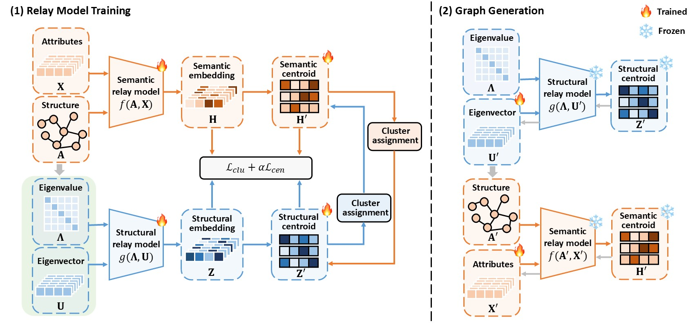

# Contrastive Graph Condensation: Advancing Data Versatility through Self-Supervised Learning

## Introduction

This repository is the implementation of [CTGC](https://arxiv.org/abs/2411.17063) (KDD'25), a self-supervised graph condensation approach designed to efficiently handle diverse downstream tasks.

\



## Requirements

All experiments are implemented in Python 3.9 with Pytorch 1.11.0.

To install the required dependencies, run:

```bash
pip install -r requirements.txt
```


## Instructions

Following is the step-by-step instruction for our proposed method CTGC.

### 1. Dataset Preparation 

Set the dataset folder path using the `--data_dir` (defaut: `./data/`).
* For Cora and CiteSeer, the code will directly download from [PyG](https://pyg.org/). 
* For Ogbn-arxiv and Reddit, we use the datasets provided by [GraphSAINT](https://github.com/GraphSAINT/GraphSAINT), which are available on [Google Drive](https://drive.google.com/open?id=1zycmmDES39zVlbVCYs88JTJ1Wm5FbfLz) or [BaiduYun (code: f1ao)](https://pan.baidu.com/s/1SOb0SiSAXavwAcNqkttwcg).


### 2. Preprocessing

Prepare the dataset and perform eigenvalue decomposition by running:

```bash
$ bash ./scr/run_preprocess.sh
```

* **Split data files** will be saved in the folder `./dataset_split/`.
* **Eigenvectors** and **eigenvalues** will be saved in the folder `./save_eigen/`.

### 3. Relay Model Pre-training

Pre-train the semantic relay model using the following command:

```bash
$ bash ./scr/run_pretrain.sh
```
The **pre-trained relay model** will be saved in the folder: `./save_pretrain_model/`.


### 4. Relay Model Training

Iteratively train the semantic and structural relay models by executing:

```bash
$ bash ./scr/run_relay.sh
```
The trained **relay models** and **centroid embeddings** will be stored in the directory: `./save_pretrain_model/`.


### 5. Graph Generation

Generate the condensed graph by running:

```bash
$ bash ./scr/run_condense.sh
```
The **generated graph** will be saved in the folder `./save_condensed_data/`.

## Performance Evaluation

The performances for the pre-trained relay model, semantic relay model, and the condensed graph (from Steps 3–5) are recorded in CSV files located in the folder: `./results_proposed/`.

To evaluate the models trained on the original graph, run:
```bash
$ bash ./scr/run_whole.sh
```
The performances are recorded in the folder: `./results_whole/`.


## Citation

```
@inproceedings{gao2024contrastive,
  title={Contrastive graph condensation: Advancing data versatility through self-supervised learning},
  author={Gao, Xinyi and Li, Yayong and Chen, Tong and Ye, Guanhua and Zhang, Wentao and Yin, Hongzhi},
  booktitle={Proceedings of the 31th ACM SIGKDD Conference on Knowledge Discovery and Data Mining},
  year={2025}
}
```
